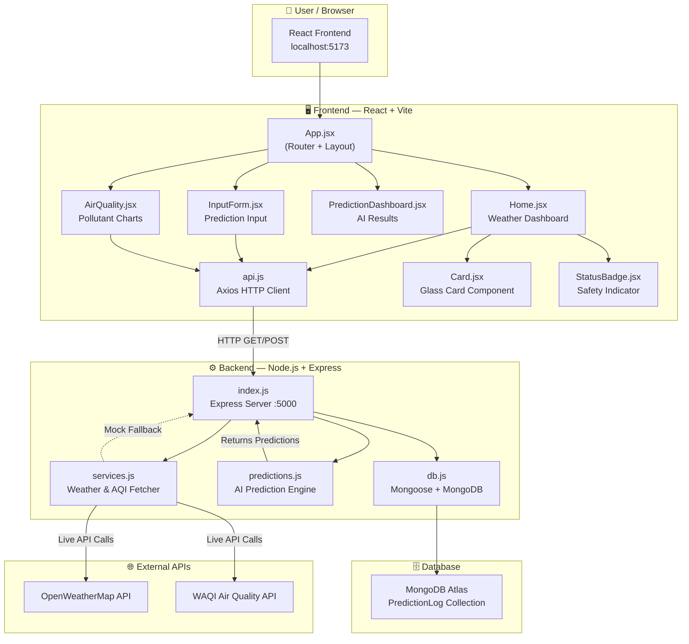
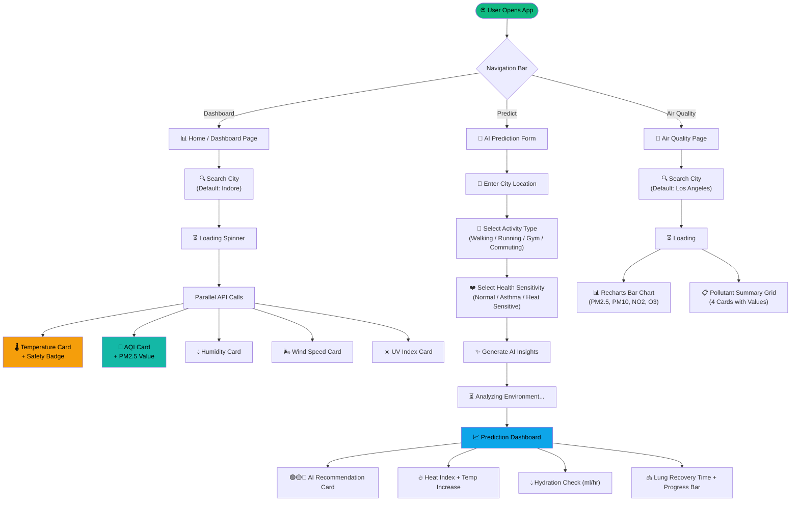
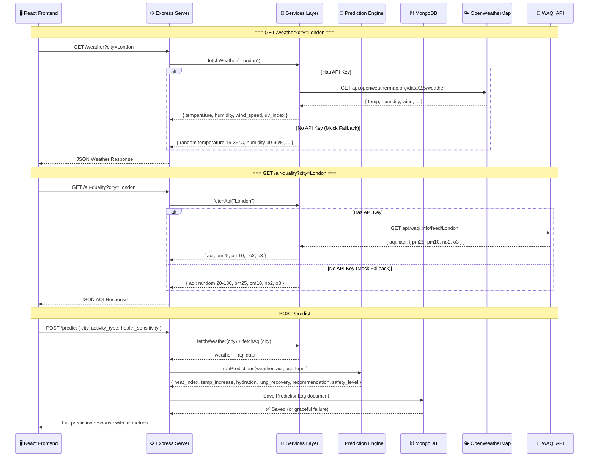
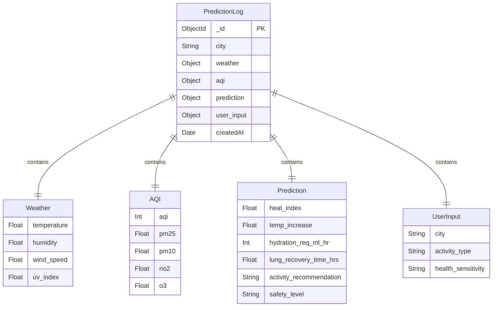
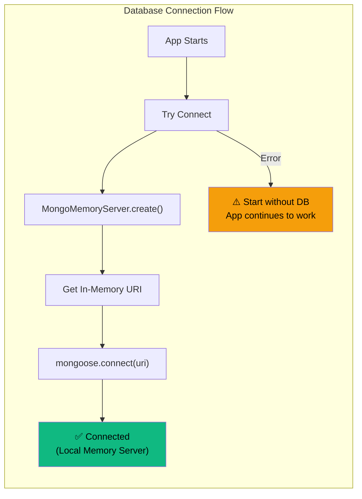
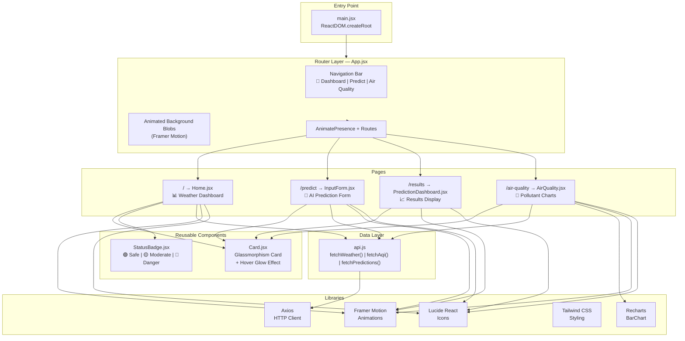
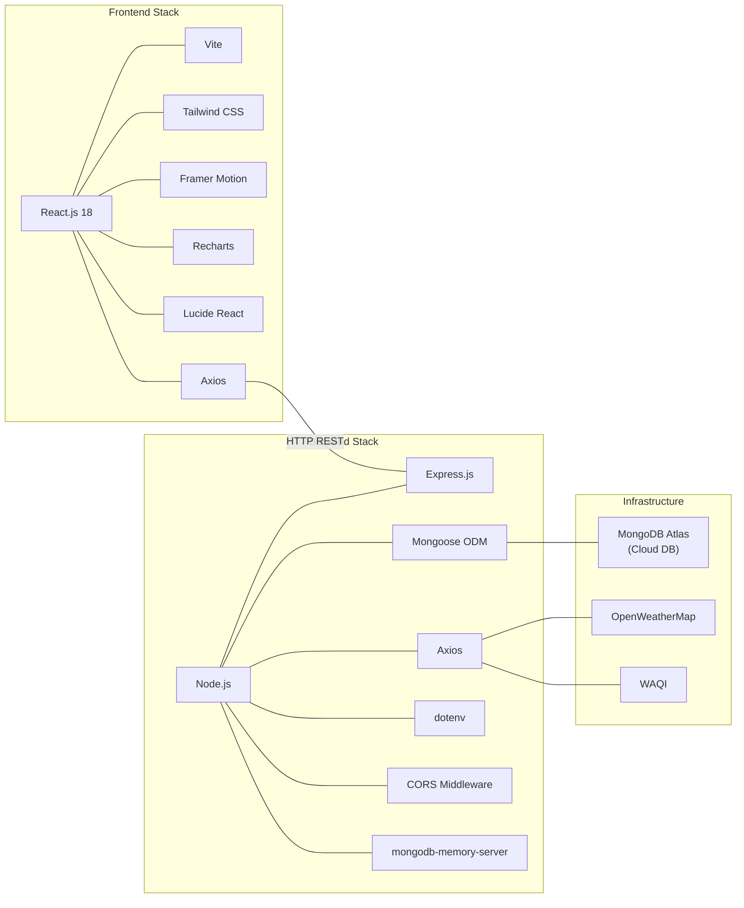
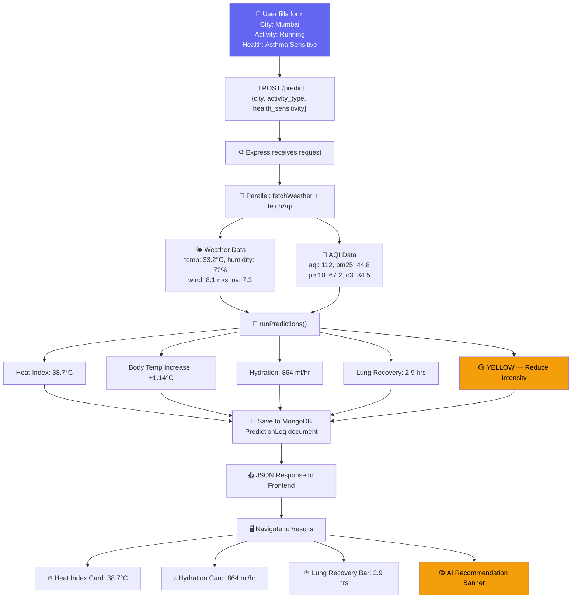

# AtmoSense AI – Complete Project Workflow Diagrams

> A detailed visual breakdown of every feature, data flow, and architectural layer.

---

## 1. High-Level System Architecture

---

## 2. Complete User Journey Flow

---

## 3. Backend API Pipeline

---

## 4. AI Prediction Engine — Internal Logic

```mermaid
flowchart TD
    INPUT["📥 Inputs<br/>weather, aqi, userInput"] --> HI["🌡️ calculateHeatIndex<br/>(temperature, humidity)"]
    INPUT --> HY["💧 calculateHydration<br/>(temperature, humidity, activity)"]
    INPUT --> LR["🫁 calculateLungRecovery<br/>(aqi, pm25, sensitivity)"]
    
    HI --> BODY["🔥 estimateBodyTempIncrease<br/>(heatIndex, activity)"]
    HI --> REC["📋 getRecommendation<br/>(aqi, heatIndex, sensitivity)"]

    subgraph HEAT_INDEX_CALC["Heat Index Calculation"]
        T1{"temp < 80°F?"} -->|Yes| SIMPLE["Simple Formula<br/>0.5 × (T + 61 + ...)"]
        T1 -->|No| COMPLEX["Rothfusz Regression<br/>-42.379 + 2.049T + 10.143H - ..."]
        SIMPLE --> HI_OUT["Heat Index °C"]
        COMPLEX --> HI_OUT
    end

    subgraph BODY_TEMP["Body Temp Increase"]
        ACT1{"Activity Type?"} -->|"Running/Gym"| B1["+0.8°C base"]
        ACT1 -->|"Walking/Commuting"| B2["+0.3°C base"]
        B1 --> HI_CHECK{"HeatIndex > 32°C?"}
        B2 --> HI_CHECK
        HI_CHECK -->|Yes| EXTRA["+ (HI - 32) × 0.05"]
        HI_CHECK -->|No| FINAL_TEMP["Final Temp Increase"]
        EXTRA --> FINAL_TEMP
    end

    subgraph HYDRATION_CALC["Hydration Calculation"]
        BASE["Base: 200 ml/hr"]
        ACT2{"Activity?"} -->|Running| R["+500 ml"]
        ACT2 -->|Gym| G["+400 ml"]
        ACT2 -->|Walking| W["+200 ml"]
        ACT2 -->|Commuting| C["+100 ml"]
        R & G & W & C --> TEMP_CHECK{"Temp > 25°C?"}
        TEMP_CHECK -->|Yes| HEAT_ADD["+ (temp-25) × 20 ml"]
        TEMP_CHECK -->|No| FINAL_ML["Final ml/hr"]
        HEAT_ADD --> FINAL_ML
    end

    subgraph LUNG_CALC["Lung Recovery Calculation"]
        LB["Base: 1.0 hr"]
        AQI_CHECK{"AQI > 50?"}
        AQI_CHECK -->|Yes| AQI_ADD["+ (AQI-50) × 0.02 hrs"]
        AQI_CHECK -->|No| SENSE_CHECK{"Asthma Sensitive?"}
        AQI_ADD --> SENSE_CHECK
        SENSE_CHECK -->|Yes| MULTIPLY["× 1.5"]
        SENSE_CHECK -->|No| FINAL_LR["Final Recovery Time"]
        MULTIPLY --> FINAL_LR
    end

    subgraph RECOMMENDATION["Safety Recommendation"]
        COND1{"AQI > 150 OR<br/>HeatIndex > 38°C?"} -->|Yes| RED["🔴 RED<br/>Dangerous — Avoid Outdoors"]
        COND1 -->|No| COND2{"AQI > 100 OR HI > 32<br/>OR Asthma+AQI>50<br/>OR HeatSens+HI>28?"}
        COND2 -->|Yes| YELLOW["🟡 YELLOW<br/>Moderate — Reduce Intensity"]
        COND2 -->|No| GREEN["🟢 GREEN<br/>Great Conditions!"]
    end

    BODY --> OUTPUT["📤 Final Prediction Output"]
    HY --> OUTPUT
    LR --> OUTPUT
    REC --> OUTPUT

    style RED fill:#ef4444,color:#fff
    style YELLOW fill:#f59e0b,color:#000
    style GREEN fill:#10b981,color:#000
```

---

## 5. Database Schema & Data Flow

---

## 6. Frontend Component Architecture

---

## 7. API Endpoints Reference

| Method | Endpoint | Parameters | Description | Response |
|--------|----------|------------|-------------|----------|
| `GET` | `/` | — | Health check | `{ message: "Welcome to AtmoSense AI" }` |
| `GET` | `/weather` | `?city=London` | Get real-time weather | `{ temperature, humidity, wind_speed, uv_index }` |
| `GET` | `/air-quality` | `?city=London` | Get AQI & pollutants | `{ aqi, pm25, pm10, no2, o3 }` |
| `POST` | `/predict` | Body: `{ city, activity_type, health_sensitivity }` | Run AI predictions | Full `PredictionLog` document |

---

## 8. Feature Coverage Matrix

| Feature | Frontend Page | Backend Module | External API | Database |
|---------|--------------|----------------|--------------|----------|
| 🌡️ Live Temperature Display | `Home.jsx` | `services.js → fetchWeather` | OpenWeatherMap | — |
| 💧 Humidity Tracking | `Home.jsx` | `services.js → fetchWeather` | OpenWeatherMap | — |
| 🌬️ Wind Speed Display | `Home.jsx` | `services.js → fetchWeather` | OpenWeatherMap | — |
| ☀️ UV Index Display | `Home.jsx` | `services.js → fetchWeather` | OpenWeatherMap | — |
| 💨 AQI Tracker | `Home.jsx` + `AirQuality.jsx` | `services.js → fetchAqi` | WAQI | — |
| 📊 Pollutant Bar Charts | `AirQuality.jsx` (Recharts) | `services.js → fetchAqi` | WAQI | — |
| 🔥 Heat Index Calculator | `PredictionDashboard.jsx` | `predictions.js → calculateHeatIndex` | — | — |
| 🌡️ Body Temp Increase Estimator | `PredictionDashboard.jsx` | `predictions.js → estimateBodyTempIncrease` | — | — |
| 💧 Hydration Alert | `PredictionDashboard.jsx` | `predictions.js → calculateHydration` | — | — |
| 🫁 Lung Recovery Time | `PredictionDashboard.jsx` | `predictions.js → calculateLungRecovery` | — | — |
| 🟢🟡🔴 Activity Safety Recommendation | `PredictionDashboard.jsx` | `predictions.js → getRecommendation` | — | — |
| 🔍 City Search | `Home.jsx` + `AirQuality.jsx` | All endpoints accept `city` | — | — |
| 📝 Prediction Logging | — | `index.js → POST /predict` | — | MongoDB `PredictionLog` |
| 🎭 Mock Data Fallback | — | `services.js` (auto-detect no keys) | — | — |
| ✨ Animated Transitions | `App.jsx` + all pages (Framer Motion) | — | — | — |
| 🪟 Glassmorphism UI | `Card.jsx` + `index.css` | — | — | — |
| 📱 Responsive Design | All pages (Tailwind breakpoints) | — | — | — |

---

## 9. Technology Stack Overview

---

## 10. Complete End-to-End Data Flow (Prediction Feature)

---

> **Summary**: AtmoSense AI is a full-stack MERN application that combines real-time weather and air quality data with an AI prediction engine to deliver personalized health and outdoor activity insights. The system features 3 API endpoints, 5 prediction algorithms, 4 frontend pages, mock data fallback, MongoDB persistence, and a premium glassmorphism UI with animated transitions.
