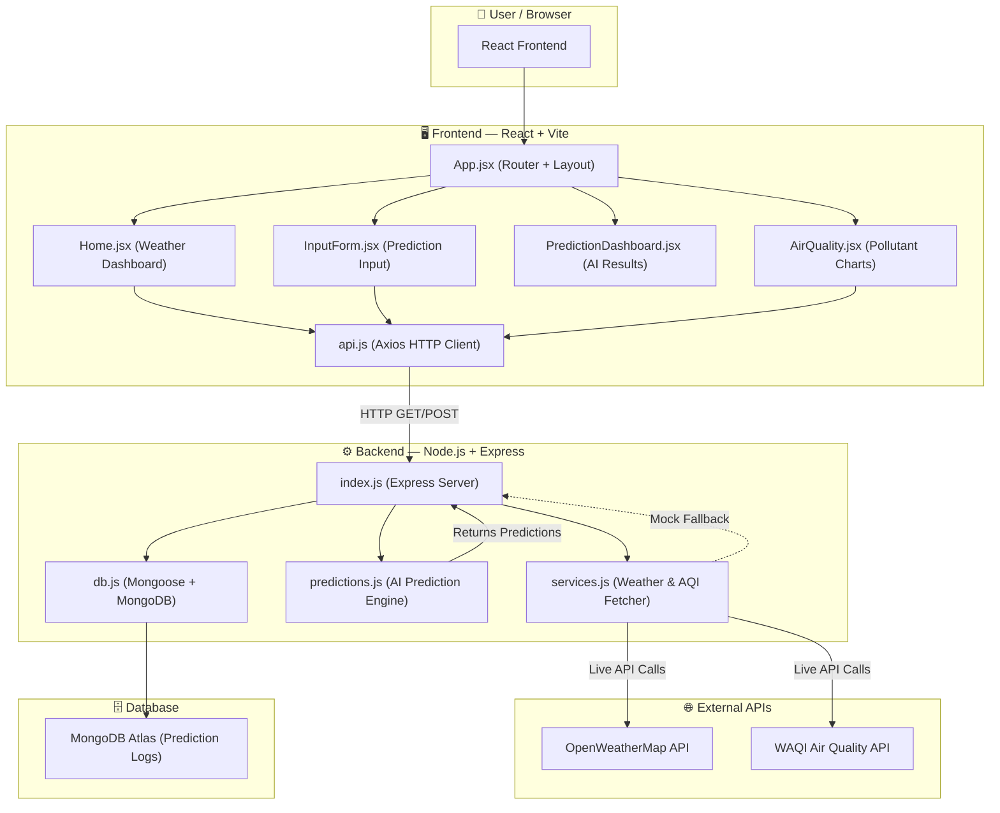
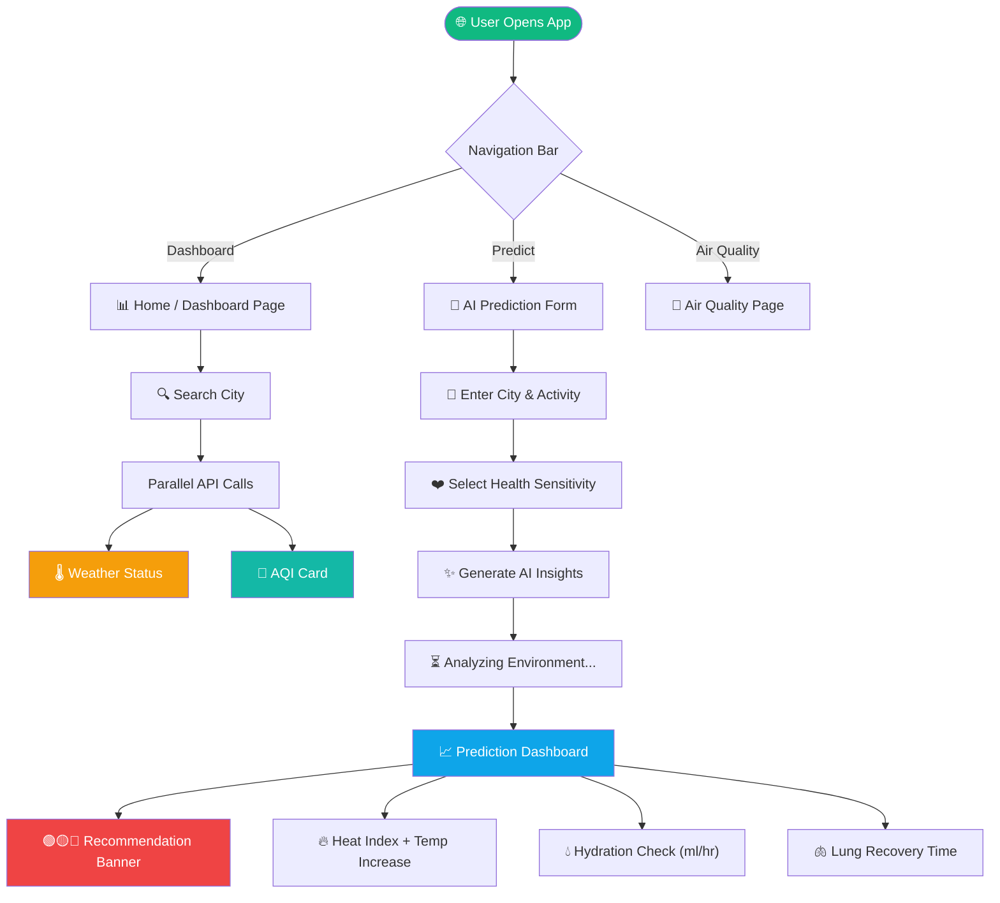

# AtmoSense AI - Smart Environmental Health Intelligence 🌫️🤖

Welcome to **AtmoSense AI** (also known as AuraCast)! This is a full-stack AI-driven web application that collects real-time weather and Air Quality data and converts it into personalized health and outdoor activity insights.

## 🌟 Key Features

*   **Real-time Dashboard:** View live temperature, humidity, wind speed, and UV index for any city.
*   **Air Quality Tracker (AQI):** Interactive visual charts using Recharts for PM2.5, PM10, and Ozone levels.
*   **AI Health Prediction Engine:**
    *   **Heat Index Calculator:** Estimates core body temperature increase during hot weather activities.
    *   **Hydration Alert:** Calculates recommended water intake (ml/hr) based on environmental conditions and activity intensity.
    *   **Lung Recovery Time:** Estimates time required for lungs to recover based on PM2.5 pollution levels and health sensitivities (e.g., Asthma).
    *   **Activity Recommendations:** Provides color-coded safety alerts (Green, Yellow, Red) for outdoor activities.
*   **Rain Prediction Ensemble:** AI-based rain prediction using ensemble modeling from multiple weather data providers.

---

## 🏗️ System Architecture

The AtmoSense AI system uses a robust client-server architecture built for scalability and ease of deployment.



---

## 🔄 User Journey & Data Flow



---

## 🛠️ Technology Stack

**Frontend:**
*   React 18 + Vite
*   Tailwind CSS (Glassmorphism & modern UI)
*   Recharts (Data Visualization)
*   Lucide React (Icons)
*   Axios (API Communication)
*   Clerk (Authentication)

**Backend:**
*   Node.js & Express.js
*   MongoDB & Mongoose
*   Cors & Dotenv

---

## 🚀 Deployment Instructions

The project is fully configured for continuous deployment on modern cloud platforms.

### Frontend Deployment (Vercel)
The frontend is optimized for **Vercel**.
1. Import the `AtmoSense-AI-frontend` directory into Vercel.
2. The framework preset should automatically be detected as **Vite**.
3. **Environment Variables:**
   *   Add `VITE_API_URL` and point it to your deployed backend URL (e.g., `https://atmosense-backend.onrender.com`).
4. Vercel SPA routing is already handled via the included `vercel.json`.

### Backend Deployment (Render)
The backend is optimized for **Render**.
1. Create a new "Web Service" on Render and connect your GitHub repository.
2. Select the `AtmoSense-AI-node-backend` folder as the Root Directory.
3. Build Command: `npm install`
4. Start Command: `npm start`
5. **Environment Variables:**
   *   `PORT`: `5000` (Render handles this dynamically).
   *   `MONGODB_URL`: Your MongoDB Atlas connection string.
   *   `OPENWEATHER_API_KEY`: Your OpenWeather API key.
   *   `WAQI_API_KEY`: Your WAQI API key.

---

## 💻 Local Development

### Step 1: Start the Node.js Backend

1. Navigate to the backend folder:
   ```bash
   cd AtmoSense-AI-node-backend
   npm install
   npm run dev
   ```
*(The backend will now be running at `http://localhost:5000`)*

### Step 2: Start the React Frontend

1. Open a **new** terminal window and navigate to the frontend folder:
   ```bash
   cd AtmoSense-AI-frontend
   npm install
   npm run dev
   ```
*(Your UI is now ready at `http://localhost:5173`)*

---

**Enjoy building with AtmoSense AI! 🚀**
<h1>made by Ansh,Ankit,Aniket</h1>
